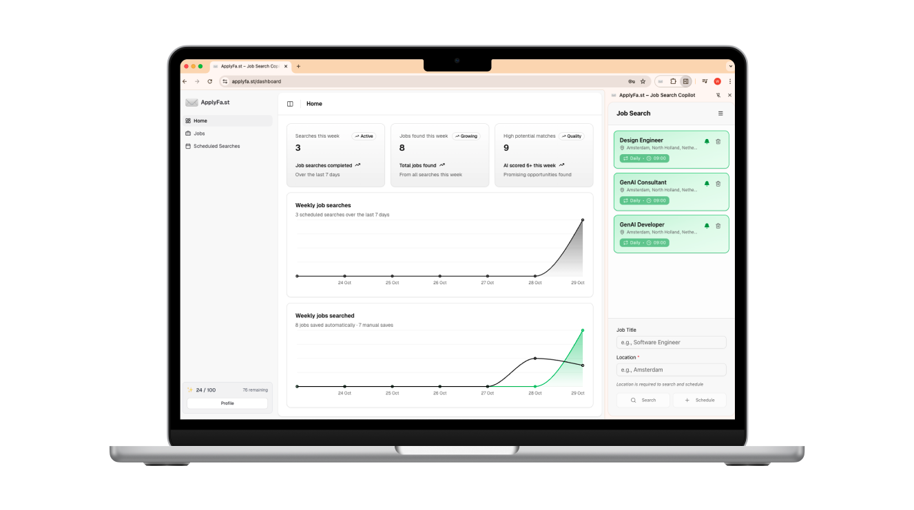

# ✉️ ApplyFast - Job Search Copilot



**ApplyFast** is a job search copilot that scores jobs as you browse and finds new matches for you daily.

Built for the [Google Chrome Built-in AI Challenge](https://googlechromeai2025.devpost.com/).

> **🚀 Quick Start:** Want to test this project quickly? The easiest way is to install the [Chrome extension](chrome-extension/HACKATHON_SETUP.md) and use the live backend at [applyfa.st](https://applyfa.st). This lets you try the local AI scoring features without setting up API keys. If you prefer to run your own backend, follow the full setup instructions below.

---

## Getting Started

### Prerequisites

Before you begin, make sure you have:

- **Node.js 20+** - [Download](https://nodejs.org/)
- **Convex account** - Free tier at [convex.dev](https://convex.dev)
- **Chrome Canary/Dev/Beta 127+** - For Chrome AI features ([Download](https://www.google.com/chrome/canary/))
- **Apify API key** - For job scraping ([Get free key](https://console.apify.com/account/integrations))
- **Vercel AI Gateway key** - For AI scoring ([Setup guide](https://vercel.com/docs/ai-gateway))
- **Resend API key** - For emails ([Get key](https://resend.com/api-keys))
- **Relevance AI key** - For LinkedIn imports ([Get key](https://relevanceai.com))

### Installation

**1. Clone the repository and install dependencies:**

```bash
git clone https://github.com/wardjl/applyfast.git
cd applyfast
npm install
```

**2. Configure your environment:**

```bash
cp .env.example .env.local
```

Edit `.env.local` with your credentials:

```env
# Convex Configuration
NEXT_PUBLIC_CONVEX_URL=your_convex_url_here
CONVEX_DEPLOYMENT=your_convex_deployment_here
CONVEX_SITE_URL=http://localhost:3000

# Admin & Diagnostics
ADMIN_USER_IDS=user_123abc,user_456def
ENABLE_DATA_INSPECTOR=false
JOB_SCRAPING_DEBUG=false

# Job Scraping
APIFY_API_KEY=your_apify_key_here

# AI Scoring
AI_GATEWAY_API_KEY=your_vercel_ai_gateway_key_here
AI_GATEWAY_SCORING_MODEL=google/gemini-2.5-flash-lite
AI_GATEWAY_ONBOARDING_MODEL=google/gemini-2.5-pro

# Email Notifications
RESEND_API_KEY=your_resend_key_here

# LinkedIn Profile Import
RELEVANCE_API_KEY=your_relevance_key_here
```

`ADMIN_USER_IDS` expects Convex user document ids (e.g. values returned from `getAuthUserId`). Those ids can trigger admin-only actions and view the data inspector even when `ENABLE_DATA_INSPECTOR` remains `false`. Toggle `JOB_SCRAPING_DEBUG` to surface detailed scraping logs in Convex functions when diagnosing issues.

**3. Initialize Convex:**

```bash
npx convex dev
```

This will:
- Create your Convex deployment if it doesn't exist
- Set up the database schema
- Configure authentication
- Open the Convex dashboard

Copy the `CONVEX_DEPLOYMENT` and `NEXT_PUBLIC_CONVEX_URL` values into your `.env.local`.

**4. Start the development server:**

```bash
npm run dev
```

The web app will be available at [http://localhost:3000](http://localhost:3000)

### Chrome Extension Setup

The Chrome extension uses **local AI (Gemini Nano)** to score jobs without sending data to servers.

**5. Enable Chrome AI:**

1. Open `chrome://flags/#prompt-api-for-gemini-nano`
2. Set to **"Enabled"**
3. Restart Chrome
4. Gemini Nano downloads automatically (~1GB, one-time)

**6. Build and load the extension:**

```bash
cd chrome-extension
cp .env.example .env
# Edit .env and set:
# VITE_CONVEX_URL=https://acoustic-ermine-73.convex.cloud (or your deployment URL)
# VITE_WEB_APP_URL=http://localhost:3000

npm install
npm run build

# Load in Chrome:
# 1. Open chrome://extensions/
# 2. Enable "Developer mode" (top right)
# 3. Click "Load unpacked"
# 4. Select chrome-extension/dist folder
```

**Detailed instructions:** See [chrome-extension/HACKATHON_SETUP.md](chrome-extension/HACKATHON_SETUP.md)

### Try It Out!

1. **Sign up** for an account at [http://localhost:3000](http://localhost:3000)
2. **Complete onboarding** - Import your LinkedIn profile and answer 5 AI-powered questions
3. **Start a job search** - Paste a LinkedIn job search URL to scrape jobs
4. **Browse on LinkedIn** - Navigate to any [LinkedIn job](https://www.linkedin.com/jobs/)
5. **Open extension** - Click the ApplyFast icon to open side panel
6. **Watch the magic** - Local AI scores the job in real-time with streaming updates!

---

## Manual QA Checklist

Before shipping a build or demoing the project, run through the core flows:

- **Landing + Waitlist** — Submit a couple of test emails and confirm toast feedback appears and the waitlist counter increments.
- **Onboarding** — Import a LinkedIn profile, complete the AI interview, and verify that the generated preferences populate the dashboard modals.
- **Scraping & Scoring** — Create a one-time scrape via the dashboard form, confirm it enqueues in Convex, and that scoring resumes automatically once the scrape completes.
- **Usage Limits** — Manually trigger scoring until the daily limit banner appears; ensure the new warning state prevents additional scoring and resets after toggling the limit in Convex.
- **Email Notifications** — For recurring or delayed searches, check that the notification email arrives (both “high scoring” and “no high scoring” variants) and that the links deep-link into the dashboard.
- **Chrome Extension** — Open a LinkedIn job posting, confirm the side panel detects it, hits the local scorer, and can save + score to the cloud without errors.

Capture notes or screenshots for any regressions and include them in the PR/QA summary.

---

## Demo Video

**[Watch the Full Demo on YouTube](https://www.youtube.com/watch?v=Nz5dZyIjyT8)**

See ApplyFast's Chrome AI integration in action with local job scoring using Gemini Nano.

**What you'll see:**
- **On-Device AI Scoring** - Gemini Nano running entirely in the browser
- **Streaming UI** - Real-time score updates character-by-character (80-120 chunks)
- **Detailed Explanations** - AI explains why jobs match your profile
- **Requirements Checker** - Visual indicators for met/unmet requirements
- **Real-Time Sync** - Extension ↔ Web app synchronization via Convex
- **Privacy-First** - All processing happens locally, zero data sent to servers

---

## Tech Stack

**Frontend & UI:**
- Next.js 15.2.3 (App Router) + React 19 + TypeScript
- Tailwind CSS + Shadcn UI Components
- TanStack Table for data visualization

**Backend & Database:**
- **Convex** - Real-time database, auth, and serverless functions
- Convex Auth for user authentication
- Scheduled jobs for recurring searches

**AI & Scoring:**
- **Chrome Gemini Nano** - Local AI scoring (privacy-first, no data sent to servers)
- **Google Gemini 2.0 Flash** - Cloud AI scoring via Vercel AI Gateway (controlled via `AI_GATEWAY_SCORING_MODEL`)
- **Google Gemini 2.5 Pro** - Onboarding interviews and profile generation (controlled via `AI_GATEWAY_ONBOARDING_MODEL`)
- Vercel AI SDK with custom Chrome AI provider

**Chrome Extension:**
- React + Vite + TypeScript
- Chrome Prompt API for local AI
- Shared UI components and Tailwind config

**External Services:**
- **Apify** - LinkedIn job scraping
- **Relevance AI** - LinkedIn profile enrichment
- **Resend** - Email notifications with React Email templates

---

## What's Included

### Chrome Extension Features

**Local AI Scoring** - On-device job scoring with Gemini Nano  
**Side Panel UI** - Dedicated workspace for job browsing  
**LinkedIn Integration** - Content script for job page detection  
**Floating Nudge Button** - Encourages scoring on LinkedIn pages  
**Real-Time Sync** - Jobs sync with web dashboard  
**Advanced Filtering** - Filter by score, date, location, keywords  
**Quick Apply** - Direct links to LinkedIn applications  
**Dark Mode** - Theme support matching main app


---

## Development

### Running the Application

```bash
# Start web app (Next.js + Convex)
npm run dev

# Build for production
npm run build

# Run linting
npm run lint
```

### Building the Web Application and Extension

```bash
npm run build                      # Build web app
npm run build:extension            # Build Chrome extension
```

**See [.env.example](.env.example) for complete environment variable documentation.**

---

## Contributing & License

This project is licensed under the **MIT License** with a Non-Commercial Intent Notice - see the [LICENSE](LICENSE) file for complete details.

**Note:** While the MIT License technically allows commercial use, this project is intended for the **Google Chrome Built-in AI Challenge 2025** and community learning purposes. The author kindly requests that you do not use, redistribute, or sell this project for commercial purposes without explicit permission. For commercial inquiries, please visit [https://uxai.studio](https://uxai.studio).

Contributions, issues, and feature requests are welcome!

---

## Additional Documentation

- **[Chrome Extension Setup Guide](chrome-extension/README.md)** - Detailed installation and troubleshooting

---

## Acknowledgments

Built with:
- [Chrome Built-in AI](https://developer.chrome.com/docs/ai/built-in) - Gemini Nano integration
- [Convex](https://convex.dev) - Real-time backend infrastructure
- [Vercel AI SDK](https://sdk.vercel.ai/) - AI orchestration framework
- [Next.js](https://nextjs.org/) - React framework
- [Shadcn UI](https://ui.shadcn.com/) - Beautiful UI components

---

Made with ❤️ for the Google Chrome Built-in AI Challenge
